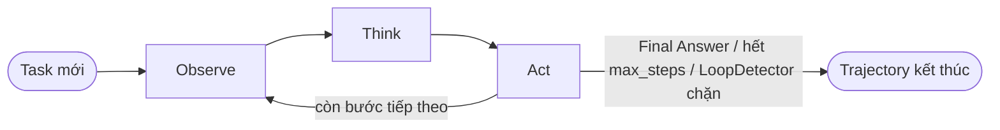

# AI Agent — Đồ án Lập trình Hướng đối tượng

> Agent theo kiến trúc **ReAct** (Reasoning + Acting) viết bằng C++, có khả năng gọi tool để thực hiện tác vụ đa bước qua LLM (Ollama/Colab), kèm theo harness tự động chạy & chấm điểm agent trên tập benchmark.

## Mục lục

- [Thành viên thực hiện](#thành-viên-thực-hiện)
- [Giới thiệu](#giới-thiệu)
- [Kiến trúc](#kiến-trúc)
- [Cấu trúc thư mục](#cấu-trúc-thư-mục)
- [Yêu cầu hệ thống](#yêu-cầu-hệ-thống)
- [Cài đặt](#cài-đặt)
- [Cấu hình môi trường](#cấu-hình-môi-trường-env)
- [Chạy chương trình](#chạy-chương-trình)
- [Công cụ đã tích hợp](#công-cụ-đã-tích-hợp)
- [Skills](#skills)
- [Benchmark và đánh giá](#benchmark-và-đánh-giá)
- [Testing](#testing)
- [Hạn chế hiện tại và việc cần làm](#hạn-chế-hiện-tại-và-việc-cần-làm)
- [Tài liệu tham khảo](#tài-liệu-tham-khảo)

## Thành viên thực hiện

| MSSV | Họ và tên |
|------|------------|
| 25127329 | Mai Trung Hiếu |
| 25127076 | Nguyễn Quốc Khánh |

## Giới thiệu

Đồ án xây dựng một AI agent theo vòng lặp **ReAct**: LLM luân phiên "suy nghĩ" (Thought) rồi "hành động" (Action) bằng cách gọi 1 trong các tool đã đăng ký, lặp lại đến khi đưa ra câu trả lời cuối (Final Answer), chạm giới hạn số bước, hoặc bị `LoopDetector` chặn vì lặp vô ích. Phần lõi (`src/`) tách lớp rõ ràng theo layer — agent loop, LLM client, tool, harness đánh giá — minh hoạ 4 design pattern GoF: Template Method, Strategy, Registry/Factory, Observer. Đi kèm là `HarnessRunner`, tự động chạy agent trên một tập task benchmark rồi chấm điểm bằng 1 trong 3 chiến lược evaluator khác nhau.

## Kiến trúc

### Vòng lặp ReAct



`AgentLoop::run()` (không virtual) cố định trình tự Observe → Think → Act; `observe()/think()/act()` là 3 primitive operation thuần virtual, không nhận tham số — dữ liệu truyền qua lại bằng state dùng chung của object (`pending_observation`, `last_response`) thay vì tham số hàm.

### Design pattern sử dụng

| Pattern | Áp dụng ở | Vai trò |
|---|---|---|
| **Template Method** | `AgentLoop::run()` gọi `observe()/think()/act()` | Cố định khung thuật toán; `ReActAgentLoop` chỉ cắm hành vi cụ thể, không đổi được trình tự gọi |
| **Strategy** | `LLMClient` (Ollama/Colab), `Tool` (8 tool), `Evaluator` (Keyword/Functional/VLM), `Environment` (Native/Sandbox) | Hoán đổi implementation lúc runtime mà code gọi (`AgentLoop`, `HarnessRunner`) không cần biết chi tiết |
| **Registry/Factory** | `ToolRegistry` | Đăng ký tool theo tên chuỗi, tra cứu & thực thi động theo tên LLM chọn |
| **Observer/Hook** | `AgentLoop::step_hook` (`std::function<void(Step)>`), `HarnessRunner::onStepRecorded` | Agent "bắn" sự kiện mỗi step; harness lắng nghe để ghi `Trajectory` mà agent không cần biết harness tồn tại |

Sơ đồ lớp UML đầy đủ: [`docs/class_diagram.png`](docs/class_diagram.png).

## Cấu trúc thư mục

```text
.
├── benchmark/                # Harness đánh giá: entry point run_eval.cpp + tasks.json
├── benchmark_workspace/      # (runtime) workspace agent đọc/ghi khi chạy benchmark
├── docs/
│   └── class_diagram.png     # Sơ đồ lớp UML — đề bài còn yêu cầu thêm 2 sequence diagram + 1 component diagram, xem mục Hạn chế
├── skills/                   # File .md mô tả kỹ năng dùng tool, SkillLoader nạp lúc chạy
├── src/
│   ├── agent/                 # AgentLoop, ReActAgentLoop, SkillLoader, LoopDetector
│   ├── client/                 # LLMClient, OllamaClient, ColabClient
│   ├── common/                  # Task, Step, json_utils
│   ├── harness/                  # HarnessRunner, Evaluator, Environment, Trajectory
│   ├── tools/                     # Tool, ToolRegistry + 8 tool cụ thể
│   └── main.cpp                    # Scratch test tay — KHÔNG nằm trong target build hiện tại
├── tests/                    # Test/demo thủ công (chưa gắn vào CMake — xem mục Testing)
├── utils/                    # base64, env loader, resolve ảnh base64
├── workspace/                # (runtime) workspace dùng khi test tay
├── result/                   # (runtime) output lẻ từ lần chạy thử
├── CMakeLists.txt
├── setup_chromedriver.sh     # Cài Chrome for Testing + chromedriver (cho WebBrowserTool)
├── start_agent.sh            # Script tiện lợi: nạp .env + build + chạy
└── README.md
```

## Yêu cầu hệ thống

Dự án hiện chỉ nhắm tới **Linux** (đã bỏ hẳn nhánh Windows/vcpkg cũ — xem comment trong `CMakeLists.txt`: *"Qua Linux xài apt rồi, quên vcpkg đi nhé!"*).

| Thành phần | Yêu cầu | Ghi chú |
|---|---|---|
| CMake | ≥ 3.25 theo khai báo, nhưng cần bản đủ mới để **nhận diện `CXX_STANDARD 26`** | Đã kiểm thử trực tiếp: CMake 3.28.3 (apt Ubuntu 24.04) báo lỗi ngay ở bước `find_package(Threads)` vì không dịch được cờ biên dịch C++26 cho GCC 14. Nâng lên CMake 4.4.2 (`pip install --break-system-packages cmake`) thì configure chạy bình thường. |
| Compiler | **GCC ≥ 15** (nhóm xác nhận đang dùng) hoặc Clang ≥ 19 | Cần cho `#embed` (C23/C++26), dùng trong `src/agent/skill_loader.cpp`. ⚠️ Đã kiểm thử: `g++-14` (bản mới nhất có sẵn qua apt mặc định trên Ubuntu 24.04) báo lỗi `invalid preprocessing directive #embed` khi build file này. Ubuntu 24.04 không có gói `g++-15` trong repo mặc định — cần thêm PPA `ubuntu-toolchain-r/test`, xem mục Cài đặt. |
| Docker | Bắt buộc nếu chạy với `--env=sandbox` (giá trị mặc định) | `SandboxEnvironment::setup()` gọi thẳng `docker run`. Dùng `--env=native` nếu máy không cài Docker. |
| Thư viện | `libcurl`, `nlohmann-json`, `libsqlite3` (cho `MemoryTool` → `agent_memory.db`), `libdbus-1` (cho `ScreenshotTool` qua XDG desktop portal), `pthread` | Tên gói apt cụ thể ở mục Cài đặt. |
| Ollama | Chạy cục bộ tại `http://localhost:11434`, đã `pull` sẵn model (mặc định `gemma4:e4b`) | Hoặc dùng `ColabClient` (LLM qua endpoint Google Colab) thay thế. |
| Tuỳ tool | `TAVILY_API_KEY` cho `web_search`; chromedriver + Chrome for Testing cho `browser`; phiên desktop Linux cho `capture_screenshot` | Xem mục [Cấu hình môi trường](#cấu-hình-môi-trường-env) và [Công cụ](#công-cụ-đã-tích-hợp). |

## Cài đặt

```bash
# GCC 15 KHÔNG có trong repo mặc định của Ubuntu 24.04 — cần thêm PPA toolchain trước.
sudo apt install software-properties-common
sudo add-apt-repository ppa:ubuntu-toolchain-r/test
sudo apt update
sudo apt install cmake gcc-15 g++-15 libcurl4-openssl-dev nlohmann-json3-dev \
                  libsqlite3-dev libdbus-1-dev pkg-config

# Nếu cmake của distro quá cũ để nhận diện C++26 (xem mục Yêu cầu hệ thống):
pip install --break-system-packages --upgrade cmake
```

> Lệnh PPA ở trên tham khảo theo trang gói chính thức của Ubuntu (`gcc-15` có build sẵn cho Noble/24.04 qua `ubuntu-toolchain-r/test`) — chưa tự chạy lại được trong môi trường soạn README này (không có mạng tới `launchpad.net`), nên nhóm chạy thử 1 lần và báo lại nếu có bước khác.

```bash
git clone https://github.com/luchub-19/OOPAI.git
cd OOPAI
CXX=g++-15 CC=gcc-15 cmake -B build -S .
cmake --build build -j$(nproc)
```

## Cấu hình môi trường (`.env`)

Tạo file `.env` ở thư mục gốc repo (đã có trong `.gitignore`, không commit):

```bash
TAVILY_API_KEY="tvly-xxxxxxxxxxxxxxxxxxxx"
BROWSER_BINARY_PATH="$HOME/chrome-for-testing/chrome-linux64/chrome"
CHROMEDRIVER_URL="http://127.0.0.1:9515"
OLLAMA_MODEL="gemma4:e4b"
OLLAMA_BASE_URL="http://localhost:11434"
```

| Biến | Bắt buộc khi nào | Mặc định nếu bỏ trống |
|---|---|---|
| `TAVILY_API_KEY` | Dùng tool `web_search` | — (tool lỗi nếu thiếu) |
| `BROWSER_BINARY_PATH` | Dùng tool `browser` | — |
| `CHROMEDRIVER_URL` | Dùng tool `browser` | `http://127.0.0.1:9515` |
| `OLLAMA_MODEL` | — | `gemma4:e4b` |
| `OLLAMA_BASE_URL` | — | `http://localhost:11434` |

`BROWSER_BINARY_PATH` và `CHROMEDRIVER_URL` không có cờ CLI tương ứng — chỉ đọc qua biến môi trường. Chạy `bash setup_chromedriver.sh` để tự cài Chrome for Testing + chromedriver khớp version (không dùng `apt install chromium`, dễ lệch version với chromedriver).

> 📄 Setup/troubleshooting chi tiết hơn cho riêng `WebBrowserTool` (đọc log lỗi thường gặp, thứ tự kiểm tra khi chromedriver không kết nối được...): xem [`README_WebBrowserTool.md`](README_WebBrowserTool.md).

## Chạy chương trình

### Chạy nhanh bằng `start_agent.sh`

```bash
chmod +x start_agent.sh
./start_agent.sh --tasks=benchmark/tasks.json --out=benchmark/results
```

Script tự lo: nạp `.env` → cài chromedriver/Chrome for Testing nếu chưa có → build nếu chưa build → bật `chromedriver` nền → chạy agent, forward toàn bộ tham số dòng lệnh.

> ⚠️ **Cần sửa trước khi dùng:** dòng cuối script hiện gọi `./build/run_eval`, nhưng `CMakeLists.txt` định nghĩa target tên `AI_Agent` (`add_executable(AI_Agent ...)`) — binary thật sự build ra nằm ở `./build/AI_Agent`. Cho tới khi 1 trong 2 chỗ được sửa lại cho khớp, `start_agent.sh` sẽ dừng ở bước cuối với lỗi "No such file or directory".

### Chạy thủ công

```bash
set -a && source .env && set +a
chromedriver --port=9515 &   # bỏ qua nếu không dùng tool browser
./build/AI_Agent --tasks=benchmark/tasks.json --out=benchmark/results
```

| Cờ | Mặc định | Ý nghĩa |
|---|---|---|
| `--tasks=` | `benchmark/tasks.json` | File task đầu vào |
| `--out=` | `benchmark/results` | Thư mục ghi trajectory + summary |
| `--base-url=` | `http://localhost:11434` | Endpoint Ollama |
| `--model=` | `gemma4:e4b` | Model LLM |
| `--env=` | `sandbox` | `sandbox` (cần Docker) hoặc `native` (thư mục thật, không cần Docker) |
| `--temperature=` | `0.0` | |
| `--max-tokens=` | `2048` | |
| `--tools=` | rỗng = cho phép tất cả | Danh sách tool được phép, phân tách bằng dấu phẩy — VD `--tools=calculator,file` |

Biến môi trường `OLLAMA_BASE_URL`/`OLLAMA_MODEL` được đọc làm giá trị mặc định; cờ dòng lệnh nếu có sẽ ghi đè lên biến môi trường.

## Công cụ đã tích hợp

| Tên tool (`--tools=`) | Class | Mô tả | Yêu cầu thêm |
|---|---|---|---|
| `calculator` | `CalculatorTool` | Tính biểu thức toán học | — |
| `file` | `FileTool` | Đọc/ghi/liệt kê file trong workspace | — |
| `exec` | `ExecTool` | Chạy lệnh shell qua `Environment` (native/sandbox) | — |
| `memory_tool` | `MemoryTool` | Lưu & tìm kiếm bộ nhớ dài hạn | SQLite (`agent_memory.db`) |
| `web_search` | `WebSearchTool` | Tìm kiếm web qua Tavily API | `TAVILY_API_KEY` |
| `browser` | `WebBrowserTool` | Điều khiển trình duyệt qua Selenium WebDriver | chromedriver + Chrome for Testing |
| `capture_screenshot` | `ScreenshotTool` | Chụp màn hình qua D-Bus/XDG desktop portal | phiên desktop Linux, `libdbus-1` |
| `code_interpreter` | `CodeInterpreterTool` | Chạy code — stateless, mỗi lần gọi là 1 chương trình độc lập | — |

Đề bài (mục III.3.2) yêu cầu tối thiểu 5 tool cố định (`exec`, đọc/ghi file, `web_search`, memory, `calculator`) cộng thêm ít nhất 3 tool khác loại tham khảo từ OpenClaw/Hermes — 8 tool ở trên đã đáp ứng đủ (`browser`, `capture_screenshot`, `code_interpreter` là phần thêm). Riêng `web_search`: đề bài mô tả gốc dùng SearXNG hoặc DuckDuckGo API, repo hiện dùng Tavily API thay thế — nên nêu rõ lý do đổi (bỏ dependency Docker cho live demo) trong báo cáo nếu cần bám sát đề bài.

## Skills

`SkillLoader` nạp toàn bộ file `.md` trong `skills/` lúc chạy; nội dung khớp từ khoá được chèn vào system prompt của agent. Nếu thư mục `skills/` không tìm thấy lúc runtime (VD chạy binary từ working directory khác gốc repo), có sẵn 1 bản dự phòng của `calculator.md` được nhúng thẳng vào binary lúc biên dịch bằng `#embed` để agent không mất trắng hướng dẫn dùng tool `calculator`.

| File | Trạng thái | Nội dung |
|---|---|---|
| `calculator.md` | ✅ | Bắt buộc gọi tool cho mọi phép tính, tránh hallucination số học |
| `memory.md` | ✅ | Khi nào nên lưu / tìm trong tool `memory_tool` |
| `code_interpreter.md` | ✅ | Khi nào dùng `code_interpreter` thay vì `calculator`/`exec` |
| `error_recovery.md` | ⏳ Trống | Chưa có nội dung |
| `task_planner.md` | ⏳ Trống | Chưa có nội dung |

Đề bài (mục III.3.3) chỉ yêu cầu tối thiểu 3 skill file có nội dung thật — đã đủ (`calculator`, `memory`, `code_interpreter`). `error_recovery.md`/`task_planner.md` để trống không vi phạm yêu cầu tối thiểu, nhưng đề bài đặt tên sẵn 2 file này trong cây thư mục gợi ý (mục VI) nên để trống dễ trông như thiếu sót khi chấm.

## Benchmark và đánh giá

`HarnessRunner` điều phối theo trình tự: setup `Environment` → `runAgent` (chạy `ReActAgentLoop` trên 1 `Task`) → chọn `Evaluator` theo `Task::eval_type` → `evaluate` → teardown `Environment` → sang task kế tiếp → in báo cáo tổng kết.

3 chiến lược evaluator (`Evaluator::evaluate()` trả `std::expected<float, EvalError>` — tách rõ "không chấm được vì sao" khỏi "chấm được và fail"):

- **`keyword`** — điểm = số keyword (danh sách CSV trong `eval_script`) tìm thấy / tổng số keyword.
- **`functional`** — chạy `eval_script` như 1 lệnh shell, nhận đường dẫn trajectory JSON; exit code `0` → điểm `1.0`, khác `0` → `0.0`.
- **`vlm`** — "LLM-as-judge": 1 `LLMClient` khác chấm điểm theo tiêu chí văn xuôi tự do trong `eval_script`, parse dòng `SCORE: <0.0-1.0>` từ câu trả lời.

Đề bài (mục III.3.6) chỉ yêu cầu tối thiểu 2 evaluator (Keyword + Functional) — đã có thêm `vlm`, vượt yêu cầu.

Task khai báo trong `benchmark/tasks.json`. Đề bài (mục VII.3) yêu cầu tối thiểu **10 task**, phân bố 4 đơn giản (tính toán, đọc/ghi file, lấy thời gian) / 4 trung bình (kết hợp 2-3 tool liên tiếp, có điều kiện) / 2 khó (multi-step, agent tự quyết định thứ tự tool call) — hiện `tasks.json` chỉ có **1 task** (`task_008`). Kết quả (trajectory + summary) ghi ra thư mục `--out=` (mặc định `benchmark/results/`, đã gitignore).

## Testing

`tests/` có nhiều file test/demo thủ công, mỗi file tự có `main()` riêng (`test.cpp`, `agentloop.cpp`, `calculator_tool.cpp`, `web_search_tool.cpp`, `web_browser_tool_full_test.cpp`, …), nhưng **hiện chưa được gắn vào `CMakeLists.txt`** — không có `add_executable` hay `enable_testing()`/CTest cho thư mục này, nên phải tự biên dịch từng file thủ công nếu muốn chạy.

## Hạn chế hiện tại và việc cần làm

Đối chiếu với đề bài `OOP_Project_2026`, xếp theo mức ảnh hưởng điểm:

- [ ] **Benchmark thiếu nhiều so với yêu cầu (mục VII.3, ảnh hưởng điểm mục Benchmark 15đ):** đề bài yêu cầu tối thiểu 10 task (4 đơn giản / 4 trung bình / 2 khó), `tasks.json` hiện chỉ có 1 task
- [ ] **Thiếu 3/4 diagram theo đề bài (mục 4.3):** `docs/` mới có `class_diagram.png`; đề bài còn yêu cầu Sequence Diagram (1 lần agent chạy hoàn chỉnh), Sequence Diagram (HarnessRunner chạy batch), và Component Diagram — cả 3 đều dùng mermaid
- [ ] `Tài liệu (15đ)` theo đề bài còn cần 1 báo cáo riêng (mô tả thiết kế/khó khăn/kết quả, 6đ) và slide thuyết trình (5đ) — nằm ngoài phạm vi README này
- [ ] Đồng bộ tên binary giữa `CMakeLists.txt` (target `AI_Agent`) và `start_agent.sh`/comment trong `run_eval.cpp` (đang ghi `run_eval`)
- [ ] Chạy thử lại đúng 1 lần các lệnh PPA/cài `gcc-15` ở mục Cài đặt trên máy nhóm để xác nhận, hiện mới tham khảo từ tài liệu chứ chưa tự test được trong lúc soạn README này
- [ ] `tests/` chưa gắn vào CMake/CTest, phải build tay từng file
- [ ] `workspace/`, `benchmark_workspace/`, `result/` là thư mục sinh ra lúc chạy nhưng đang bị commit vào git — cân nhắc thêm vào `.gitignore`

Đã đáp ứng đủ yêu cầu tối thiểu của đề bài: 8 tool (mục III.3.2, cần 5+3), 3 evaluator (mục III.3.6, cần 2), 3 skill file có nội dung (mục III.3.3, cần 3), 21 commit (mục VI, cần ≥12 cho nhóm 2 người).

## Tài liệu tham khảo

- https://ollama.com
- https://cmake.org
- https://github.com/nlohmann/json
- https://docs.tavily.com
- https://www.selenium.dev/documentation/webdriver
